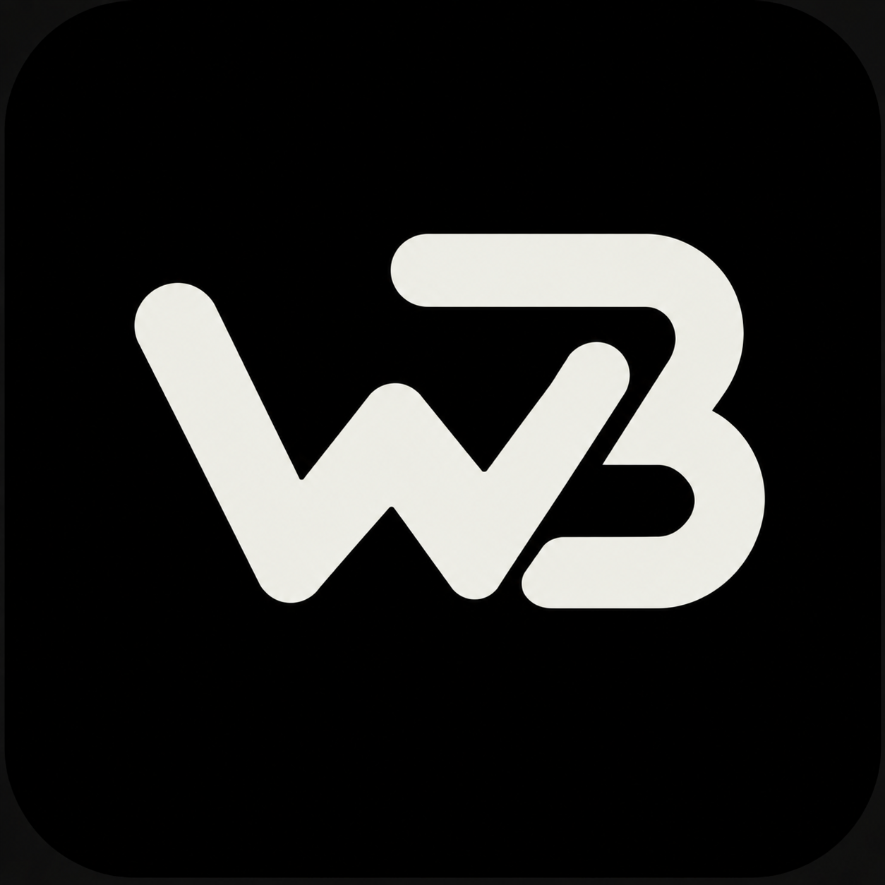
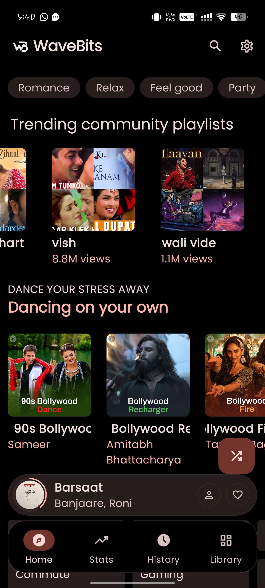
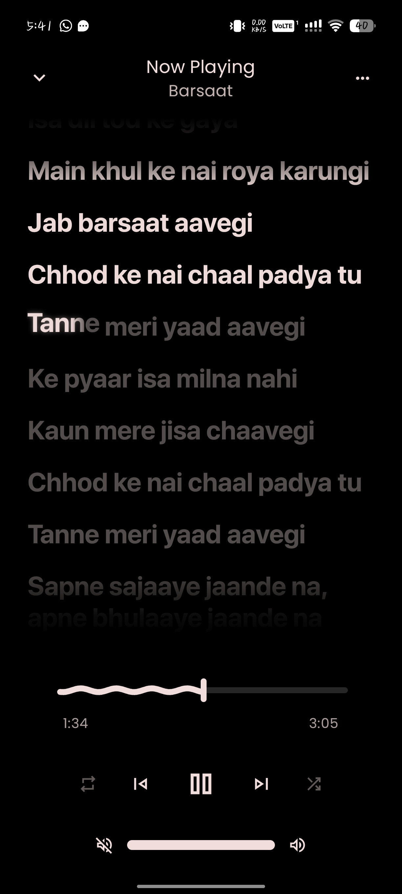
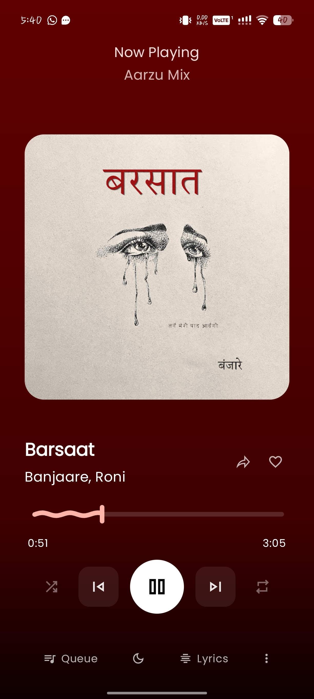
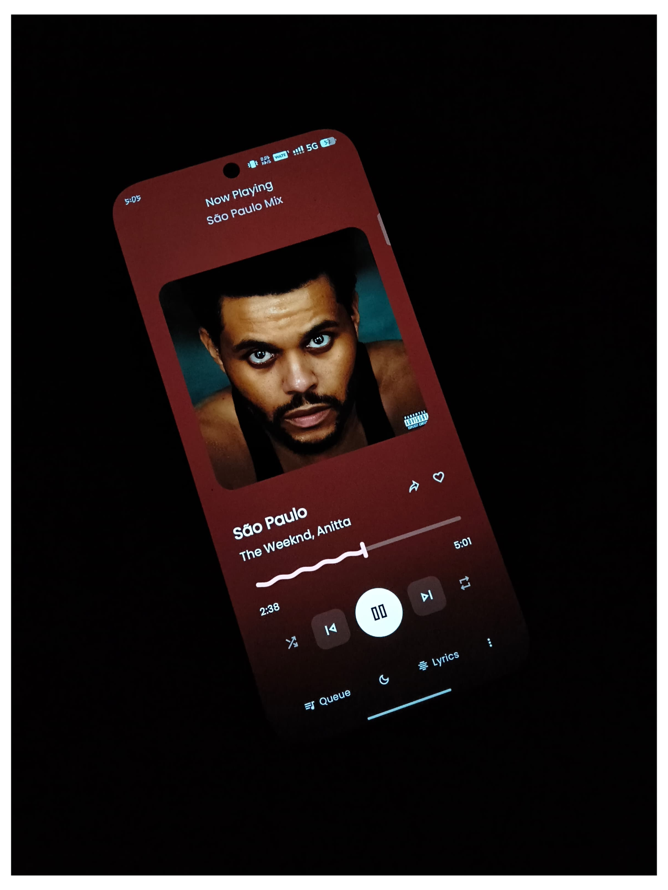
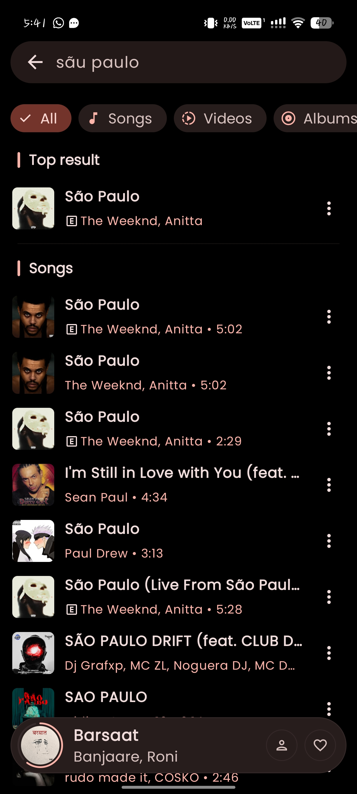

  

# 🎵 WaveBits

**Free. Uninterrupted. Yours.**

WaveBits is a free music streaming app that brings together the best of what you love from Spotify, Gaana, and JioSaavn — without the ads, without the interruptions, and without the price tag.

> **Spotify + Gaana + JioSaavn = WaveBits**

  
  

---

## 📖 Table of Contents

- [About WaveBits](#about-wavebits)
- [Key Features](#key-features)
- [Why WaveBits?](#why-wavebits)
- [Screenshots](#screenshots)
- [Tech Stack](#tech-stack)
- [Roadmap](#roadmap)
- [FAQ](#faq)
- [License](#license)
- [Contact & Support](#contact--support)

---

## About WaveBits

WaveBits was built on a simple idea: **great music shouldn't come with a paywall or a pause button every three songs.** Most free music apps interrupt your listening experience with ads every few tracks, while premium tiers lock away uninterrupted playback behind a monthly subscription.

WaveBits changes that. It's a single app that merges the massive international catalog you'd expect from Spotify, the regional and Bollywood depth of Gaana, and the Indian film & indie music strength of JioSaavn — all wrapped into one **completely free, ad-free** experience.

---

## Key Features

### 🚫 No Ads, Ever
Listen from start to finish without banner ads, audio ads, or forced video ads interrupting your flow.

### 🎧 Uninterrupted Playback
Continuous background play, gapless transitions between tracks, and no forced pauses — even with the screen locked or the app minimized.

### 🌍 Massive Combined Library
- International hits and global charts (Spotify-style catalog)
- Bollywood, regional, and devotional music (Gaana-style catalog)
- Indian indie, film soundtracks, and podcasts (JioSaavn-style catalog)

### 🆓 100% Free
No subscription tiers, no "premium unlocks," no hidden paywalls. Every feature is available to every user, always.

### 🔊 High-Quality Audio
Stream in multiple quality settings, up to high-fidelity audio, based on your network and preference.

### 📴 Offline Downloads
Download your favorite tracks, albums, and playlists to listen offline — no data usage, no ads even when offline.

### 🎶 Smart Playlists & Recommendations
AI-curated playlists based on your mood, listening history, and habits — daily mixes, throwback playlists, and discovery radio.

### 🔍 Powerful Search
Search by song, artist, album, mood, language, or even lyrics.

### 🌐 Multi-Language Support
Full support for regional languages including Hindi, Punjabi, Tamil, Telugu, Bengali, and more, alongside English and international tracks.

### 📱 Cross-Platform Sync
Your playlists, likes, and listening history sync seamlessly across Android, iOS, and Web.

### 🎤 Lyrics & Karaoke Mode
Real-time synced lyrics for sing-along and karaoke-style playback.

### 🌙 Dark Mode & Custom Themes
A sleek, modern interface with full dark mode support and customizable themes.

---

## Why WaveBits?

| Feature | Spotify Free | Gaana Free | JioSaavn Free | **WaveBits** |
|---|---|---|---|---|
| Ads | ✅ Yes | ✅ Yes | ✅ Yes | ❌ **No Ads** |
| Uninterrupted Playback | ❌ No | ❌ No | ❌ No | ✅ **Yes** |
| Offline Downloads | ❌ Premium only | ❌ Premium only | ❌ Premium only | ✅ **Free** |
| High-Quality Audio | ❌ Premium only | ❌ Limited | ❌ Limited | ✅ **Free** |
| Regional + International Catalog | ⚠️ Partial | ⚠️ Regional-focused | ⚠️ Regional-focused | ✅ **Combined** |
| Price | Free/Paid tiers | Free/Paid tiers | Free/Paid tiers | ✅ **Always Free** |

---

## Screenshots

| Home | Now Playing (Lyrics) | Now Playing (Album Art) |
|---|---|---|
|  |  |  |

| Now Playing (Style) | Search |
|---|---|
|  |  |

**Home** — Curated mood categories, trending community playlists, and personalized mixes right on launch.
**Now Playing** — Full-screen synced lyrics, artwork, and smooth scrub controls for every track.
**Search** — Instant results across songs, videos, and albums as you type.

---

## Tech Stack

> *Update this section with your actual stack.*

- **Frontend:** React Native / Flutter / Kotlin (Android) / Swift (iOS)
- **Backend:** Node.js / Django / Spring Boot
- **Database:** PostgreSQL / MongoDB
- **Audio Streaming:** ExoPlayer (Android) / AVPlayer (iOS)
- **Authentication:** Firebase Auth / OAuth 2.0
- **Cloud & CDN:** AWS S3 + CloudFront / Google Cloud Storage
- **Recommendation Engine:** Python (scikit-learn / TensorFlow)
- **CI/CD:** GitHub Actions

---

## Roadmap

- [x] Ad-free streaming engine
- [x] Offline downloads
- [x] Multi-language support
- [ ] Social listening (listen together with friends)
- [ ] Podcast integration
- [ ] Voice-controlled playback
- [ ] Smartwatch companion app
- [ ] Lyrics-based search

---

## FAQ

**Q: Is WaveBits really free forever?**
A: Yes. There are no subscription tiers or hidden premium unlocks.

**Q: How does WaveBits stay ad-free?**
A: WaveBits is designed around a sustainable, non-intrusive model that doesn't rely on interrupting the listening experience with ads.

**Q: Can I download songs for offline listening?**
A: Yes, offline downloads are available to all users at no extra cost.

**Q: Does WaveBits work internationally?**
A: Yes, WaveBits combines both international and regional Indian music catalogs.

---

## License

This project is licensed under the [MIT License](LICENSE).

---

## Contact & Support

- 📧 Email: tpxlegend438@gmail.com
- 🌐 Website: [wavebits.vercel.app](#)
  
---

Made with ❤️ for music lovers who just want to press play.

